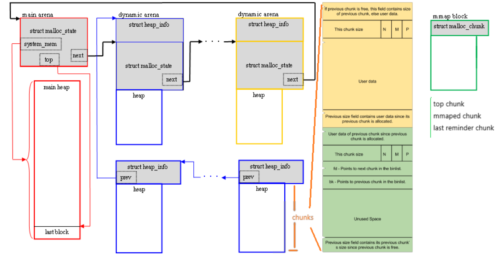
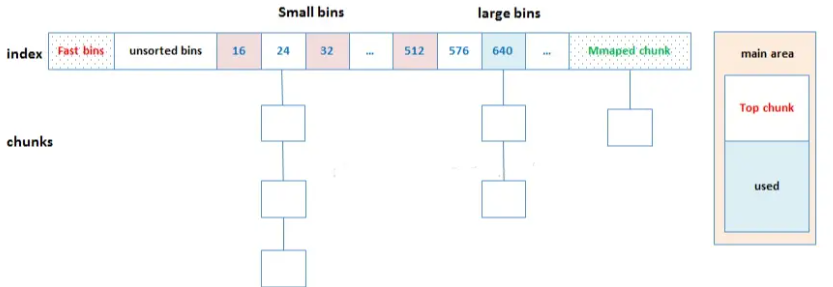
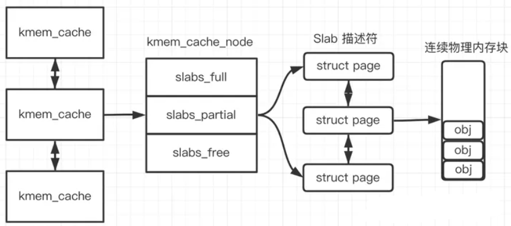

# tcmalloc分析
commit_id 674ee53f07374b715e134a4bf210d3746a1712c3

## tcmalloc架构图

tcmalloc采用三级缓存,小对象从ThreadCache获取，大对象从PageAllocator获取。

与linux内存内存管理类似，PageHeap简化版伙伴系统，TransferCacheManager类似slab分配算法，TransferCache类似kmem_cache负责固定大小对象分配与释放，Span与slab类似管理连续页，形成空闲链表或数组。

## PageAllocator
PageAllocator负责分配Span(管理连续n个页)，类似代理真正的工作由PageHeap或HugePageAwareAllocator负责。单例，定义在static_var.h。

### PageHeap
PageHeap以数组形式管理kMaxPages(128)个SpanListPair链表，链表中每个Span包含的页都相同，和一个单独的包含大于kMaxPages页Span的链表。
PageHeap主要管理未使用的Span，由PageMap负责映射PageId到Span*的映射。考虑线程安全。PageMap内部使用PageMap2基数树，无哈希冲突，空间换时间。

#### Span* New(Length n, SpanAllocInfo span_alloc_info)
负责分配包含n个页的Span。调用AllocateSpan，先从n对应链表中找，没有就从更大的链表中找，找到后分割Span，余下部分放到对应大小的链表中。若还未找到则GrowHeap调用SystemAlloc，获取页，构建Span。

####  void Delete(Span* span, size_t objects_per_span)
尝试合并前后的Span放回对应链表中

## TransferCacheManager
TransferCacheManager管理kNumClasses个TransferCache。每个size空闲块对应一个。负责选择合适的TransferCache，并用其进行空闲块的分配与释放。空闲块分配与释放采用数组而非链表的形式。

### TransferCache
TransferCache管理特定size的空闲块，利用数组缓存部分空闲块，不够时向CentralFreeList申请，多余时还给CentralFreeList。

### CentralFreeList
CentralFreeList管理正在使用的Span链表，将Span链表分成kNumLists个链表进行管理。

#### int CentralFreeList<Forwarder>::RemoveRange(void** batch, int N)
分配时从链表中选取非空的Span获取空闲块，没有就调用Populate获取Span，在其上建立空闲链表，映射PageId与Span*。获取Span的页数由SizeClassInfo决定。

#### void CentralFreeList<Forwarder>::InsertRange(absl::Span<void*> batch)
负责释放空闲块到对应Span中，若Span不再被使用，则调用forwarder_.DeallocateSpans立刻释放回PageAllocator。将返回的每个空闲块对应的Span保存到Span* spans[kMaxObjectsToMove]。一批空闲块最多128个。

## ThreadCache
thread_local变量。负责为其线程申请释放小对象。

### FreeList
单向空闲链表，缓存固定size空闲块

#### void* Allocate(size_t size_class)
从对应FreeList获取一块空闲块，若没有则调用FetchFromTransferCache获取一批空闲块。空闲块数量：std::min<int>(list->max_length(), batch_size)。batch_size由SizeClassInfo决定。获取后对FreeList.max_length()+1或std::min(list->max_length() + batch_size, kMaxDynamicFreeListLength);

#### ThreadCache::Deallocate(void* ptr, size_t size_class)
将空闲块释放回FreeList，FreeList超过max_length则调用DeallocateSlow。

#### void DeallocateSlow(void* ptr, FreeList* list, size_t size_class)
调用ListTooLong和Scavenge。

ListTooLong调用ReleaseToTransferCache释放batch_size个空闲块。然后尝试调整max_length。调整策略为：当max_length小于batch_size则max_length+1,当大于且被调用三次则max_length-batch_size。

## 底层内存管理

### SystemAlloc与SystemRelease
MmapRegion线性管理MmapAligned利用mmap系统调用申请的虚拟内存。MmapRegion的内存由MallocInternal(没看懂)申请。RegionManager管理多个AddressRegion，通过AddressRegion分配内存。SystemAlloc通过RegionManager分配内存。
SystemRelease利用madvise系统调用释放内存。

## 元数据的内存管理

### Arena
Arena一次至少从SystemAlloc申请128KB，线性管理，只分配不回收。不够一次分配的部分直接丢弃，重新申请。位于static_var.h的静态变量arena_负责元数据内存分配。PageMap基数树结点直接从arena_分配。

### PageHeapAllocator
PageHeapAllocator模板类，用于元数据内存分配。内部有空闲链表和arena。从arena申请，释放到空闲链表。
静态变量PageHeapAllocator span_allocator_、PageHeapAllocator<ThreadCache> threadcache_allocator_都使用arena_。

# 内存池对比

## 与ptmalloc，jemalloc对比
参考：https://cloud.tencent.com/developer/article/2390348

### ptmalloc
glibc使用ptmalloc。ptmalloc包括主分配区（main arena），动态分配区（dynamic arena），主分配区与动态分配区用环形链表进行管理。

每一个分配区利用互斥锁（mutex）使线程对于该分配区的访问互斥。每个进程只有一个主分配区，但可能存在多个动态分配区，ptmalloc根据系统对分配区的争用情况动态增加动态分配区的数量，分配区的数量一旦增加，就不会再减少了。主分配区在二进制启动时调用sbrk从heap区域分配内存，动态分配区则会直接调用mmap()分配内存。

#### 问题
1.如果后分配的内存先释放，无法及时归还系统。因为 ptmalloc 收缩内存是从top chunk开始,如果与top chunk相邻的chunk不能释放, top chunk以下的chunk都无法释放。

2.内存不能在线程间移动，动态分配区只增不减，多线程使用内存不均衡将导致内存浪费

3.每个chunk至少8字节的开销很大，且内存合并在chunk级别上

4.加锁耗时，无论当前分区有无耗时，在内存分配和释放时，会首先加锁。

## linux slab分配器与伙伴系统

### slab分配器

