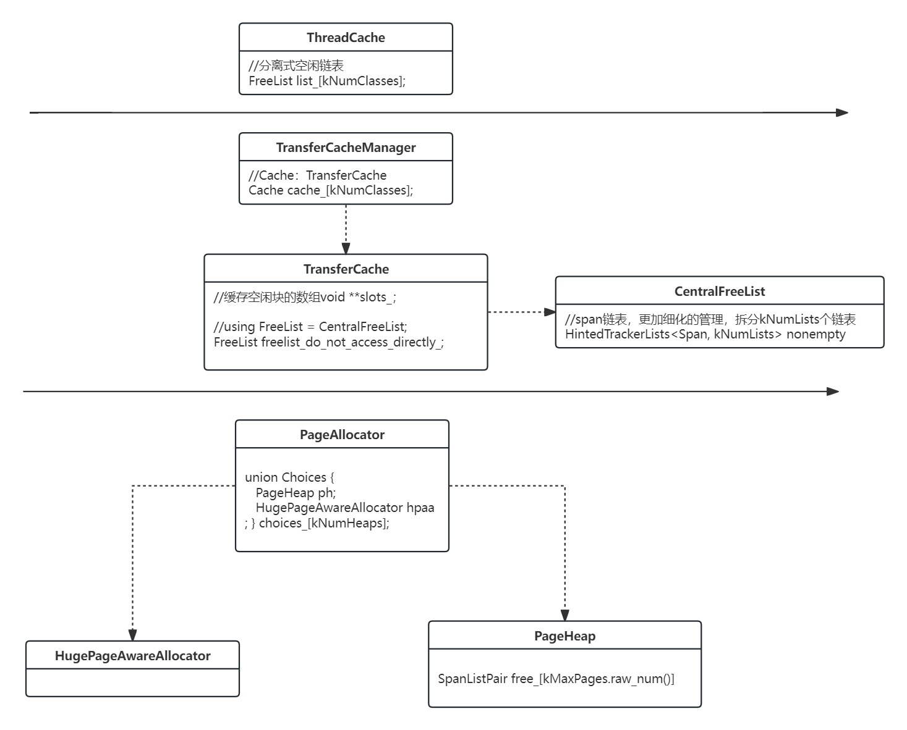

# tcmalloc分析

## tcmalloc架构图


tcmalloc采用三级缓存,小对象从ThreadCache获取，大对象从PageAllocator获取。

## PageAllocator
PageAllocator负责分配Span(管理连续n个页)，类似代理真正的工作由PageHeap或HugePageAwareAllocator负责。单例，定义在static_var.h。

### PageHeap
PageHeap以数组形式管理kMaxPages(128)个SpanListPair链表，链表中每个Span包含的页都相同，和一个单独的包含大于kMaxPages页Span的链表。
PageHeap主要管理未使用的Span，由PageMap负责映射PageId到Span*的映射。考虑线程安全。

主要方法：

#### Span* New(Length n, SpanAllocInfo span_alloc_info)
负责分配包含n个页的Span。调用AllocateSpan，先从n对应链表中找，没有就从更大的链表中找，找到后分割Span，余下部分放到对应大小的链表中。若还未找到则GrowHeap调用SystemAlloc，获取页，构建Span。
```c++
Span* PageHeap::SearchFreeAndLargeLists(Length n, bool* from_returned) {
  for (Length s = n; s < kMaxPages; ++s) {
    SpanList* ll = &free_[s.raw_num()].normal;
    if (!ll->empty()) {
      TC_ASSERT_EQ(ll->first()->location(), Span::ON_NORMAL_FREELIST);
      *from_returned = false;
      return Carve(ll->first(), n);
    }
    //....
  }
  return AllocLarge(n, from_returned);  
}

bool PageHeap::GrowHeap(Length n) {
  if (n > Length::max()) return false;
  auto [ptr, actual_size] = SystemAlloc(n.in_bytes(), kPageSize, tag_);
  if (ptr == nullptr) return false;
  n = BytesToLengthFloor(actual_size);

  stats_.system_bytes += actual_size;
  const PageId p = PageIdContaining(ptr);
  if (ABSL_PREDICT_TRUE(pagemap_->Ensure(p - Length(1), n + Length(2)))) {
    Span* span = Span::New(p, n);
    RecordSpan(span);
    span->set_location(Span::ON_RETURNED_FREELIST);
    MergeIntoFreeList(span);
    return true;
  } else {//....}
}
```

####  void Delete(Span* span, size_t objects_per_span)
尝试合并前后的Span放回对应链表中
```c++
void PageHeap::Delete(Span* span, size_t objects_per_span) {
  info_.RecordFree(span->first_page(), span->num_pages());
  span->set_location(Span::ON_NORMAL_FREELIST);
  MergeIntoFreeList(span); 
}

void PageHeap::MergeIntoFreeList(Span* span) {
  const PageId p = span->first_page();
  const Length n = span->num_pages();
  Span* prev = pagemap_->GetDescriptor(p - Length(1));
  if (prev != nullptr && prev->location() == span->location()) {
    // Merge preceding span into this span
    TC_ASSERT_EQ(prev->last_page() + Length(1), p);
    const Length len = prev->num_pages();
    RemoveFromFreeList(prev);
    Span::Delete(prev);
    span->set_first_page(span->first_page() - len);
    span->set_num_pages(span->num_pages() + len);
    pagemap_->Set(span->first_page(), span);
  }
  Span* next = pagemap_->GetDescriptor(p + n);
  if (next != nullptr && next->location() == span->location()) {
    // Merge next span into this span
  }

  PrependToFreeList(span);
}
```

